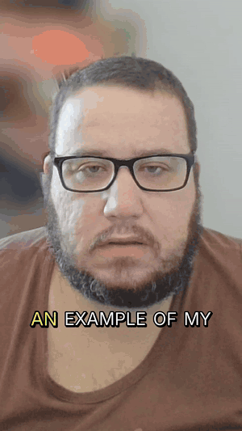

# shortificator

<section class="shortificator-hero" markdown>
<div markdown>
<p class="shortificator-kicker">Local video pipeline</p>
<h1 class="shortificator-title">Long videos into vertical Shorts.</h1>
<p class="shortificator-lede">
shortificator transcribes a source video, asks a local Ollama model for the best moments,
reframes the footage to 9:16, burns readable subtitles, and renders ready-to-post clips.
No paid external APIs are required.
</p>
<div class="shortificator-actions" markdown>
[Get started](getting-started/index.md){ .md-button .md-button--primary }
[CLI reference](reference/cli.md){ .md-button }
</div>
</div>
<div class="shortificator-media">
  
  
</div>
</section>

<div class="feature-grid" markdown>
<div class="feature-card" markdown>
### Fully local
Whisper transcription runs with faster-whisper on CUDA, and the editorial pass uses Ollama on your machine.
</div>
<div class="feature-card" markdown>
### Shorts-ready output
The renderer crops to 9:16, tracks faces with YuNet when needed, and muxes final audio/video with FFmpeg.
</div>
<div class="feature-card" markdown>
### Fast iteration
Saved transcripts and candidate files let you rerender without repeating Whisper or LLM work.
</div>
</div>

## Pipeline at a glance

```text
input.mp4 or YouTube URL
   |
   |-- transcribe        faster-whisper, CUDA, word timestamps
   |-- analyze clips     Ollama structured output
   |-- reframe           face, center, gameplay or auto crop
   |-- caption           static or dynamic burned-in subtitles
   `-- render            FFmpeg output/*_short_NN.mp4
```

## A practical first command

<div class="command-card" markdown>

```bash
poetry run python -m shortificator \
  --input my_video.mp4 \
  --model mistral-small \
  --max-shorts 5 \
  --crop-mode face \
  --content-mode talking-head \
  --dynamic-subtitles
```

</div>

For game footage, switch to `--crop-mode gameplay --content-mode gameplay` so the crop stays stable and the LLM looks for action, tension, wins, failures, and player reactions.
